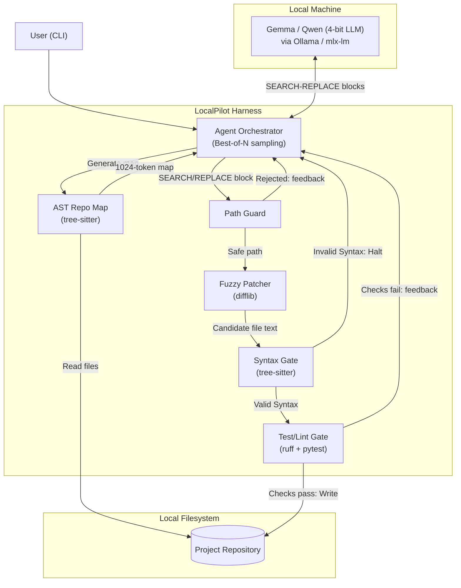

# LocalPilot

**A Verification-First Coding Harness for Small, Local LLMs.**

[](https://opensource.org/licenses/MIT)

LocalPilot is a terminal-based AI coding agent that runs entirely on your local machine. It is designed to be a safe and reliable "harness" for small, open-weight language models (like Google's Gemma or Qwen's 7B Coder), compensating for their potential weaknesses with a suite of deterministic, verification-first tools.

This project was built for the **[Hackathon Name]**, competing in the **Open-Source AI / Model Harness** track.

---

## Table of Contents

- [The Problem](#the-problem)
- [The Solution: A Safety Harness](#the-solution-a-safety-harness)
  - [Core Features](#core-features)
  - [The Verification Pipeline](#the-verification-pipeline)
- [Architecture](#architecture)
- [Tech Stack](#tech-stack)
- [Getting Started](#getting-started)
- [Benchmark](#benchmark)
- [Agent Skill](#agent-skill)
- [License](#license)

---

## The Problem

Large, proprietary models are powerful but come with privacy, cost, and vendor lock-in concerns. Smaller, open-weight models offer a solution, but they often struggle with the precision required for code editing. They can hallucinate file paths, produce syntactically incorrect code, or misinterpret the user's intent, leading to broken codebases.

## The Solution: A Safety Harness

LocalPilot acts as a safety harness around a small LLM. It never lets the model write directly to your files. Instead, it forces the model to use a structured format and validates every single change before it's committed to disk.

### Core Features

- **100% Local & Private:** Runs entirely on-device using Ollama or MLX (Apple Silicon). Your code never leaves your machine.
- **Path Guard:** Every file path the model names is resolved and checked before anything is read or written. Paths that escape the project root are rejected, and paths that don't exist are matched against real files so the model gets a "did you mean ...?" hint instead of a silent failure.
- **Fuzzy Patching:** Instead of relying on the LLM to provide perfect `diff`s, LocalPilot uses a fuzzy matching algorithm (`difflib`) to find the best location for the model's proposed change, making it resilient to minor inaccuracies in the `SEARCH` block.
- **Syntax Gate:** The agent **cannot write a file that fails a syntax check**. It uses tree-sitter to parse the proposed change in memory, and if the new code contains syntax errors, the write is aborted and the model is asked to fix its own mistake.
- **Test/Lint Gate:** After the syntax gate passes, the candidate change is applied to a throwaway copy of the project and checked with `ruff` and, if the project has tests, `pytest`. A change that breaks lint or existing tests is rejected and the failure output is fed back to the model.
- **Best-of-N Verified Sampling:** For harder tasks, LocalPilot samples several candidate edits from the model and keeps the first one that passes every gate. The deterministic gates act as the judge, which lifts the success rate of small models without any extra training.
- **AST-Powered Context:** To give the model a bird's-eye view of the repository, LocalPilot generates a "repo map" by parsing the Abstract Syntax Tree (AST) of each file. This map contains only definitions (classes, functions), fitting a high-level overview into a small token budget.
- **Built-in Benchmark:** A small task suite lets you run the same model with and without the harness and compare success and syntax-error rates.
- **Model Agnostic:** While designed with Gemma in mind, it works with any model served through an OpenAI-compatible API, including those from `Ollama` and `mlx-lm`.

### The Verification Pipeline

Every edit the model proposes must pass four deterministic gates, in order, before it touches your disk:

| # | Gate | What it checks | On failure |
|---|---|---|---|
| 1 | Path Guard | Path is inside the project root and exists (or is a close match) | Model gets a "did you mean ...?" hint |
| 2 | Fuzzy Patch | `SEARCH` block matches one location above the similarity threshold | Model is asked to resend a more precise block |
| 3 | Syntax Gate | New code has no more tree-sitter `ERROR`/`MISSING` nodes than before | Model is asked to fix its syntax |
| 4 | Test/Lint Gate | `ruff` and `pytest` pass on a temporary copy of the project | Failure output is fed back to the model |

Only a change that clears all four gates is written to disk.

## Architecture

LocalPilot orchestrates a conversation between the user, a local LLM, and a set of verification tools.



## Tech Stack

| Layer | Tool | Purpose |
|---|---|---|
| Inference | `Ollama` or `mlx-lm` | Run a 4-bit quantized model locally |
| Model (Default) | `gemma:2b-instruct` | Small, powerful open-weight model |
| Parsing | `tree-sitter`, `tree-sitter-language-pack` | AST parsing for syntax checks and repo map |
| Patching | `difflib.SequenceMatcher` | Fuzzy-match SEARCH blocks |
| Path Guard | `pathlib`, `difflib.get_close_matches` | Confine edits to the project and suggest real paths |
| Lint/Test Gate | `ruff`, `pytest` | Verify candidate changes on a temporary copy |
| CLI | `typer`, `rich` | Commands and rich terminal output |
| HTTP Client | `httpx` | Communicate with the local LLM server |
| Token Counting | `tokenizers` | Enforce context token budgets |

## Getting Started

### Prerequisites

- Python 3.12 recommended (3.10 to 3.14 supported; see PYTHON_COMPAT.md)
- [Ollama](https://ollama.com/) installed and running.

### 1. Installation

```bash
# Clone the repository
git clone <your-repo-url>
cd localpilot

# Create a virtual environment and install dependencies
python3 -m venv .venv
source .venv/bin/activate
pip install -r requirements.txt

# Download and compile tree-sitter parsers
python src/build_parsers.py
```

### 2. Setup the Local LLM (Gemma)

```bash
# Pull a small Gemma model via Ollama
ollama pull gemma:2b-instruct
```

A 2B model can struggle with the edit-block format on harder tasks. If you have the memory, a larger model such as `qwen2.5-coder:7b` is a drop-in upgrade; set it with the `--model` flag.

### 3. Run the Agent

Use the `localpilot` CLI to give the agent a task in your codebase.

```bash
# Ask the agent to perform a task on a repository
localpilot run "Refactor the 'calculate_total' function in 'src/utils.py' to also accept a 'discount_rate' argument." --dir /path/to/your/project
```

The agent will show its plan, apply edits, and display a final diff upon completion.

Useful options:

```bash
# Sample 3 candidate edits per step and keep the first that passes every gate
localpilot run "<task>" --dir /path/to/project --best-of 3

# Use a different model
localpilot run "<task>" --dir /path/to/project --model qwen2.5-coder:7b
```

## Benchmark

LocalPilot ships with a small task suite in `bench/` to measure what the harness adds. Each task is run on the same model twice: once with raw, ungated edits (baseline) and once through the full verification pipeline.

```bash
python bench/run_bench.py --model gemma:2b-instruct
```

Fill in the table below with your own results before submission:

| Mode | Tasks passed | Syntax-error rate | Broken-test rate |
|---|---|---|---|
| Baseline (no harness) | _/_ | _% | _% |
| LocalPilot (all gates) | _/_ | _% | _% |
| LocalPilot (all gates, best-of-3) | _/_ | _% | _% |

## Agent Skill

This project implements the `safe-edit` agent skill, compliant with the Agent Skill Open Standard. This skill encapsulates the workflow of proposing an edit via a SEARCH/REPLACE block and having it validated by the harness before application.

The skill definition can be found in `skills/safe-edit/SKILL.md`.

## License

This project is licensed under the MIT License. See the `LICENSE` file for details.
